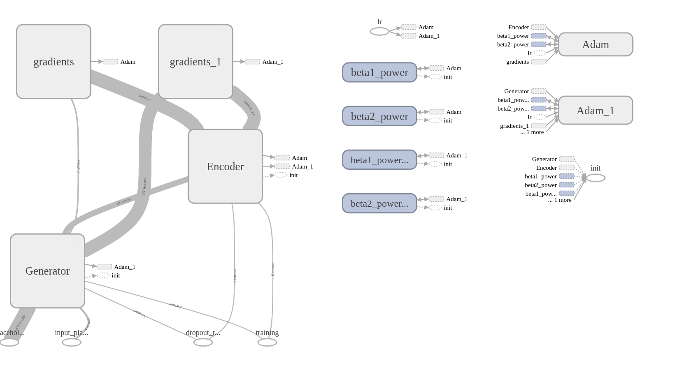
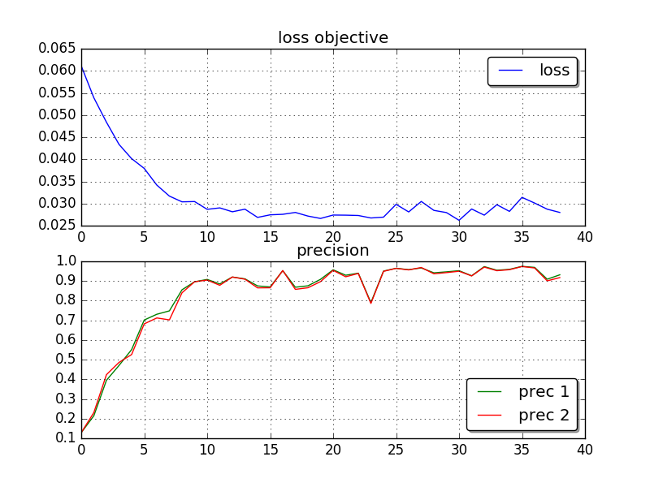

# Rationale Code

## Results:
Image of the graph of the network from tensorboard

Running this once yields the following results:

The training average loss and the precision are shown in this figure, there is an issue with replication. Must set seed numbers 
properly since there is still some source of random variation. 

### example rationales

here is a cherry picked example for the aspect of smell: 

> poured from a 24oz bottle into a large sniffter appearance : this pours a deep bronze amber in color . this beer has some of the best head formation and retention that i have ever seen along with lots and lots of sticky ** lacing smell : tons of piney resinous evergreen aroms abound ** in this ale . cant get enough of this beer its the ** best smelling ** harvest ale i 've ever had the pleasure of enjoying taste : huge flavor profile with lots of bitterness and only a little malt sweetness . as this beer warms up the bitterness really dominates the flavor . i 'm tasting lot of **subtle orange** aromas mouthfeel : full body beer with alot of carbonation overall : i love this beer in my opinion its serria nevada 's best beer overall . the price is unbeatable i bought my bombed for $ 3.99 . so much flavor and biting bitterness this harvest ale has no equal .

## Dependencies: 
Numpy (1.10.4), Tensorflow (0.11.0rc2)

## How to run the code:
1. Ensure the dependencies are installed (optional: GPU support for tf)
2. Get the data from: [here](http://people.csail.mit.edu/taolei/beer/)
3. Put the data in the data directory
4. run rationale_dependent.py, possibly with changed parameters if you wish!
5. Get coffee, mow the lawn, reclaim your social life outside of the internet, come back after several hours.
6. Check the results! Should output data/saves, where the models are stored, 
eval and train folders for tensorboard, a plot of losses and precisions and a file with rationales.

## (potential) Bugs:
- Training can collapse the predicted indices of the words into all 0's or all 1's Potential fixes for this include, lowering the learning rate or the lambda regularizers

- The input tensors can have a shape mismatch, this doesn't appear to be a problem in the theano code,however for tf it matters. Fix: in the future hard code dimensions instead of inferring them from tensors

- There is still some source of random variation. Must set the seed number properly.

